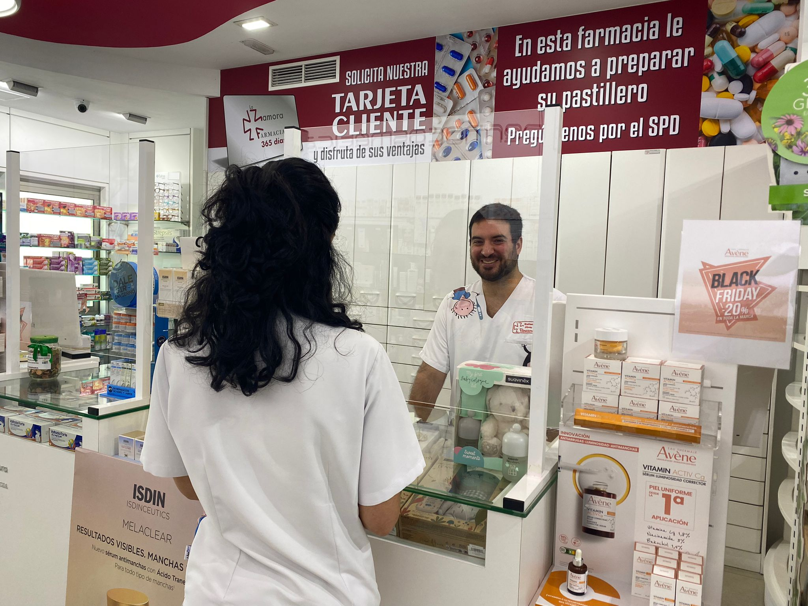
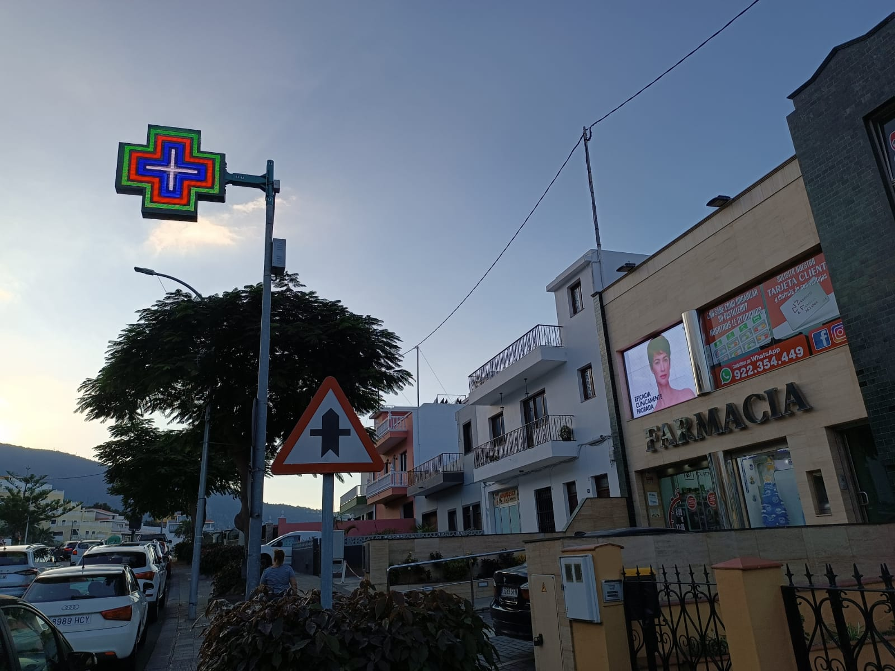

# 🧪 Estudio Farmacia 💊 Final_proyect 🐍

## 🥼 Introducción

Una farmacia de canarias quiere analizar sus datos sobre el negocio para poder ser más eficiente, localizar sus puntos fuertes y de mejora para poder realizar un plan de acción y ser más rentable.

Han solicitado tener dashboards (tiempo) para que los dueños puedan evaluar facilmente las estadísticas de la misma.

## Objetivos 

- ETL 
- Database
- Dashboards 
- Sales predictions

## Herramientas

- [Documentación Python](https://www.w3schools.com/python/default.asp)
- [Documentación MySQl](https://www.w3schools.com/mysql/default.asp)
- [Documentación PowerBI](https://learn.microsoft.com/es-es/training/paths/build-power-bi-visuals-reports/)
- [Documentación Machine Learning](https://scikit-learn.org/stable/)

## Proceso

#### 🧹 ETL ➡ Excel

#### 📚 Database ➡ MySQL

#### 📊 Dashboards ➡ PowerBI

#### 💰 Sales predictions ➡ Machine Learning

## Links recursos

- ❤️ Archivos confidenciales de la empresa objetivo de estudio 💚
- CIMA, AEMPS: agencia española de medicamentos y productos sanitarios.
    - [Base de datos bla bla](https://cima.aemps.es/cima/publico/nomenclator.html) 

## Links visualiaciones !!! creo que solo vale en tableau

Worksheets:

-
-
-
-
-
-
-

Dashboards:

-
-
-

## 🥼 Conclusiones 💊
🩸💉
👨‍⚕👩‍⚕🧑‍⚕⚕

