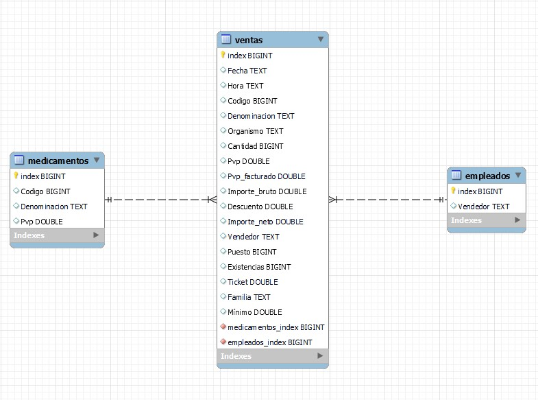
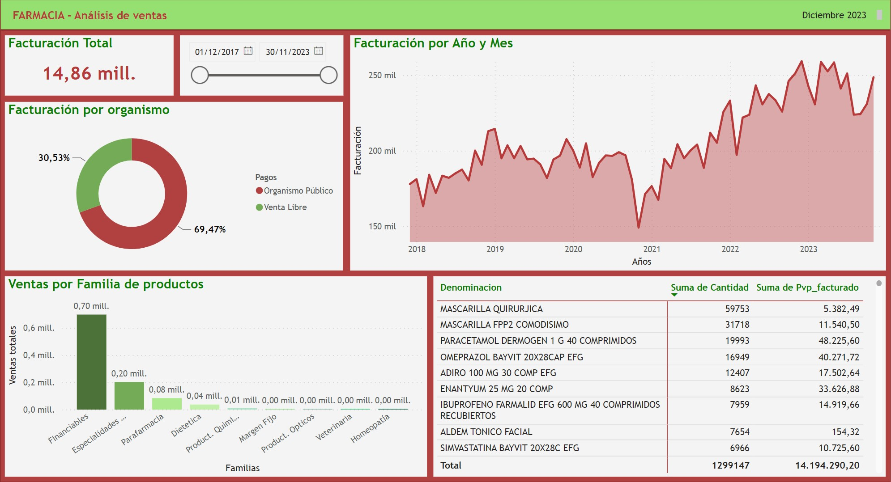
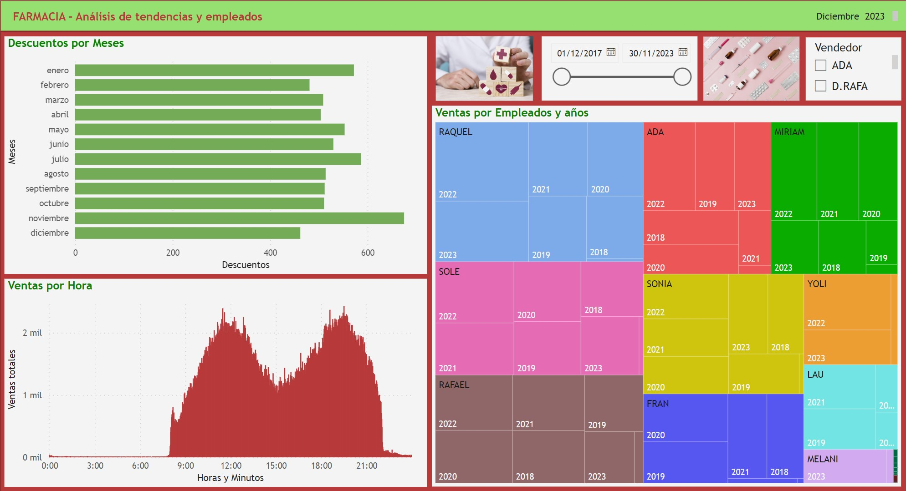

# 🧪 Estudio Farmacia 💊 Final_proyect 🐍

## 🥼 Introducción

Una farmacia de canarias quiere analizar sus datos sobre el negocio para poder ser más eficiente, localizar sus puntos fuertes y de mejora para poder realizar un plan de acción y ser más rentable.

Han solicitado tener dashboards para que los dueños puedan evaluar facilmente las estadísticas de la misma.

## Objetivos 

- ETL 
- Database
- Dashboards 

## Herramientas

- [Documentación Python](https://www.w3schools.com/python/default.asp)
- [Documentación MySQl](https://www.w3schools.com/mysql/default.asp)
- [Documentación PowerBI](https://learn.microsoft.com/es-es/training/paths/build-power-bi-visuals-reports/)

## Proceso

#### 🧹 ETL ➡ Excel

Primero limpio el archivo pdf articulos para volverlo un excel y poder obtener las columnas Familia y Mínimo. Luego creo una clase llamada ExcelManager para limpiar los excels, según el nombre del archivo y el tipo de datos que contiene internamente (en concreto lineas_ventas). También guarda los excels limpios y contiene otras funciones que aplico en el siguiente apartado.

#### 📚 Database ➡ MySQL

Vuelvo a utilizar mi querida clase ExcelManager para formar los dataframes según mis necesidades, conectarme automaticamente a MySQL, crear la base de datos denominada farmacia, calcular las tablas a partir de los Data Frames extraídos (medicamentos, empleados y ventas) y volcar los datos a MySQl.

Compruebo las relaciones entre las tablas ➡ Entity Relationship Diagram - ERD y finalmente me aseguro de que la tabla se ha subido adecuadamente. Si nos fijamos bien tenemos 1.214.357 filas!!!

#### 📊 Dashboards ➡ PowerBI

DashBoard 1: Análisis de ventas

1º Facturación Total. 2º Filtro por año, mes y día de los últimos 6 años, desde el 1/12/2017 hasta el 30/11/2023. 3º Facturación en porcentaje por organismo. 4º Facturación por años y meses. 5º Ventas por familia de productos y 6º Matriz que indica los nombres de los medicamentos, las cantidades compradas por clientes y la cantidad cobrada por la farmacia. 

DashBoard 2: Análisis de tendencias y empleados

1º Descuentos por meses.  2º Filtro por año, mes y día. 3º Filtro por Empleado. 4º Ventas por empleados y años y 5º Ventas por horas.

## Recursos

- 💚 Archivos confidenciales de la empresa objetivo de estudio ❤️

## 🥼 Conclusiones 💊

🩸1º 70% aprox. de las ventas son pagadas por organismos públicos, es decir, que realmente lo cobrará el negocio mínimo 1 mes después de haberlo facturado.

👨‍⚕2º La tendencia en los últimos 5 años es que la farmacia cada vez tiene más ventas.

💉3º Lo que más se venden son medicamentos, los cuales la mayoría son pagados por organismos públicos.

👩‍⚕ 4º Lo que más se vende desde el covid y actualmente son mascarillas, seguido de paracetamol, omeprazol y adiro (trombos).

🐍 5º El mes que más productos con descuentos tienen es noviembre, probablemente por el black friday. 

🧑‍⚕ 6º El top 3 empleados que más han facturado en los últimos 5 años son Raquel, Sole y Rafael.

💊 7º Hay 2 modas a la hora de ir a comprar a la farmacia y son a las 11:30 am y a las 7:30 pm.

